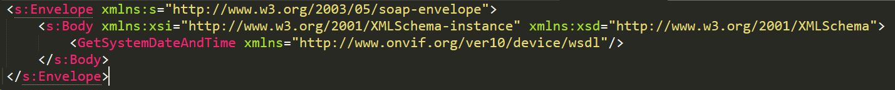

# ONVIF Compliance Tester

You can watch or download project PDF presentation (in russian) here: [project presentation](presentation.pdf).

## 1. Introduction

The main problem that existed at the moment is the impossibility of conducting quick testing of IP-video equipment and determining the capabilities of the devices.

Exsisting and famous application for ONVIF devices(solution) is written in C# and **only for Windows** systems - **ONVIF Device Manager**: for detection, viewing RTSP stream, basic equipment setup, PTZ control, Imaging.


This problem has existed since the appearance of IP cameras and other related devices in the public domain. Even very expensive equipment does not always meet the declared standards, and, in particular, [the ONVIF standart](https://www.onvif.org/). 

In addition, in 2019 in Higher School of Economics (Moscow) work was underway to build a TV complex on security IP video cameras. This approach definitely gave a cost benefit because the IP cameras were and still are quite cheap, but in return, they may not be suitable for the specific tasks for which they could be defined.

[ONVIF](https://www.onvif.org/) - is a generally accepted standardized protocol for the collaboration and interaction of various equipment and software (IP cameras, IP encoders, NVRs, and related software)


**In this regard, our goal was to automate the testing of IP cameras and other ONVIF-compatible devices, for which we developed a unique Web service using Python and React.js technologies.**

### 1.1 Scope

The system is designed to:

- provide the ability to obtain information about the characteristics and capabilities of ONVIF-compatible devices and the compliance of these functions with standards using a web service;
- to view live broadcasts from devices;
- for storing reports and results of previous device tests.

### 1.2 Brief description of main features

1. Testing of devices for compliance of the built-in functionality with the ONVIF standard
2. Storing test reports in the Service Database
3. Online broadcasting of RTSP stream from ONVIF devices
4. Obtaining information about the capabilities of the device using the generated PDF report

## 2. Description

The main objectives of the project were:
- To develop algorithms for testing selected ONVIF functions.
- To develop an application for testing selected functions according to the developed algorithms and present it as a Python script for the web interface
- To make an application on the React.js framework, implement connections between components with event handling.
- To combine all developments into one web application

### 2.1 Input data:

1. User interface - control
2. Authorization - username, password
3. OpenVPN network where devices are located
4. Input audio (AAC, G.711, G.726) and video RTSP streams from devices

- Example of ONVIF SOAP-query to IP-camera:

  

- HTTP request, via the ONVIF Python library - a convenient, concise solution that requires improvement:

  

### 2.2 Output data:

1. Summary of device testing results
2. Generated PDF report revealing
3. Saved IP video equipment test reports
4. Saved Preview from Devices (Snapshots)
5. HLS .m3u8 playlists and stream

## 3. Use-Case

### 3.1 Authorization

- When entering the system, the user is prompted to pass authentication - registration or authorization in the system.
- It is necessary to fill in all the existing fields in the selected form, otherwise the system will report an error.
In the case of the first use of the service, it is necessary to register, and the system will automatically transfer the user to the authorization page. For authorization in the system, you just need to enter your email address and password.
- It should be mentioned that the system does not store the passwords of its users, and automatically encrypts them.
When the “Remember me” option is specified, the system saves the current user session for a while.


### 3.2 Device Discovery and Dashboard

- Upon successful login, the user is automatically redirected to the main application menu.
- When you open the main menu page of the application, ONVIF-compatible devices are automatically detected using <b>WS-Discovery</b> algorithm and a list of these devices in <code>ip: port</code> format is displayed on the screen.
- The system also greets the user and displays his first and last name specified during registration.
- Next, the user is asked to select a specific device from the list to continue working with it. Next, all the necessary information will be loaded.
- If the device is not available, then an error message is displayed to the user.
- Also, the user has the ability to log out of the system to the authorization page.
To do this, click the "Logout" button.


#### 3.2.1 Information Tab

When the "Information" tab is selected, the user is shown basic information about the device, namely:
1. its address on the network;
2. manufacturer's name;
3. device model;
4. device firmwware version;
5. serial number of the device;
6. device hardware id;

#### 3.2.2 Stream Tab


 When you select the "Stream" tab, the user is shown the capabilities of the device related to streaming, namely:
 
- Getting an RTSP link for connecting a video stream
- Snapshot Url - getting a link to a snapshot from the camera
- Slideshow - viewing the images taken by the camera saved in the database
  

You can also switch between displaying a snapshot from the camera and watching a video stream with a slight buffering delay.

#### 3.2.3 Database tab

When the "Database" tab is selected, the user is shown the saved previous reports on testing devices.


### 3.3 Device Testing

When the "Testing" tab is selected, the functions supported by the device are offered for adding to the testing list. 


They are divided into services for ease of presentation. It is possible to test all functions. After adding, clicking on the "Run" button will start testing.


ONVIF consists of various profiles with different functionality, so that it is possible to test different profiles compliance, or different services(e.g Media, Imaging, PTZ) or specific functions from a variety (AbsoluteMove, ContinuousMove, etc).

### 3.4 Web-Report
- The transition to the web-report page occurs automatically. 

  This page shows the process of testing functions. Already tested functions are marked with a check mark. 

  

- After the end of testing, you can download the full report in pdf format with all the necessary information about testing. 

  Also, the automatically generated report is saved to the database, on the tab of which you can then open and view it again. 

  

- If this is not needed, you can see the Summary on the Web-Report page itself, opening additional information about testing by clicking on the function.

  

## 4. Installation
```bash
git clone https://github.com/ArtemyMagarin/onvif_tester.git
cd onvif_tester
virtualenv -p /usr/bin/python env
source env/bin/activate
pip install -r requirements.txt
ln -s `pwd`/env/wsdl `pwd`/env/lib/python2.7/site-packages/wsdl
python server.py
```

## 5. Implementation

A web application consists of two parts: front-end and back-end. The first part includes the user interface, which is connected to the second part, the back-end, using JavaScript scripts.

There is also a SQLite (using Flask-SQLAlchemy) database (which is part of the back-end) that contains user data and information about previous tests.

The system functions quite simply: after registering and logging into the web service, the user is offered a choice of all the available functions of the application. When you select any of them, a certain part of the back-end code written in Python and located on the server is called using JavaScript. The result is presented to the user.

The first part, the front-end, consists of the layout itself, written using the markup language HTML5 and CSS, as well as scripts written in React.js. 

It is necessary for correct processing of events associated with client actions, and is also responsible for unpacking and correct display of the transmitted information.

The core of the back-end is written using the Flask Python framework. It contains all the algorithms for testing device capabilities, and also allows you to work with the SQLite database, which is also part of the back-end. It stores data about previous tests, screenshots from devices and data of registered users.

### 5.1 Architecture

In the diagram below, you can see a schematic representation of the architecture of the designed application.


- The whole project was put on a Linux based server at the time. The client-side React JavaScript code is compiled and a production build is done. They are pushed to the Flask Backend server and sent using Flask's <code>render_template</code> to the Client in route /.

- The web interface communicates with the REST API using the Flask route. All tests, requests to data from cameras and ONVIF devices are made using asynchronous AJAX requests to BackEnd.

- All tests for ONVIF compliance are written using the Python library, then the test returns meta-information in JSON format and this data is transmitted to the client application in React.

- Tests are stored using Flask SQLAlchemy, classes (models) of the required tables are described in Python languages along with the indication of fields and relations, and after starting the application, the SQLite database is created automatically. 

- For authorization and interaction between the database and the Web application, descriptions of individual routes and functions are used, they transmit the necessary information, execute queries, or save data (reports, users) in the database.

- A React application is used along with the natively written Middleware, and Redux.js to store the current state and information of the application.
Redux consists of Action, Dispatcher, Reducer, State. When the event (Action) is called, the Dispatcher is called, which triggers this event, then the information is processed by the Reducer (it describes what to do to the application when an asynchronous request occurs, when an error has occurred or data has been successfully received)


## 6. Emergency situations and bugs

If the web service fails, the restoration of the normal operation of the system should be done via:
- contacting the network administrator / application developer;
- reboot uWSGI configuration;
- restarting the OpenVPN configuration on the server;

In case of incorrect user actions, incorrect formats or invalid values of the input data, the system displays the appropriate messages to the user, after which it returns to the operating state preceding the invalid (invalid) command or incorrect data entry.

In case of errors during the work of the stream, you must try to disable Cache in the browser - <code>the Networks tab</code> -> <code>Disable Cache</code>.
Or try toggling Toggler <code>Show Stream</code> <-> <code>Show Snapshot</code>.

## 7. Future work

The potential for use and implementation includes both commercial use, for example, by video engineers during filming, and for use by students during laboratory and other purposes. 

The project makes it easy to interact with cameras by showing the capabilities of the device, and allows for fine-tuning without going into standards and programming. 

In the future, it can be used to confirm non-compliance of devices with the standard and a good reason for complaints to the manufacturer.

## 8. Contributors and authors ✨

<table>
  <tr>
    <td align="center"><a><br/><b>Pavel Tsvetov</b></a><br/><a href="https://github.com/yaiestura">yaiestura 📖</a><br/>
Higher School of Economics, Moscow, Grad. 2020</td>
        <td align="center"><a><br/><b>Artemy Magarin</b></a><br/><a href="https://github.com/ArtemyMagarin">ArtemyMagarin 🤔</a><br/>
ITMO University, St.Petersburg</td>
        <td align="center"><a><br/><b>Vladislav Ustimov</b></a><br/><a href="https://github.com/DocMorg">DocMorg 💻</a><br/>
Higher School of Economics, Moscow, Grad. 2020</td>
  </tr
</table>
